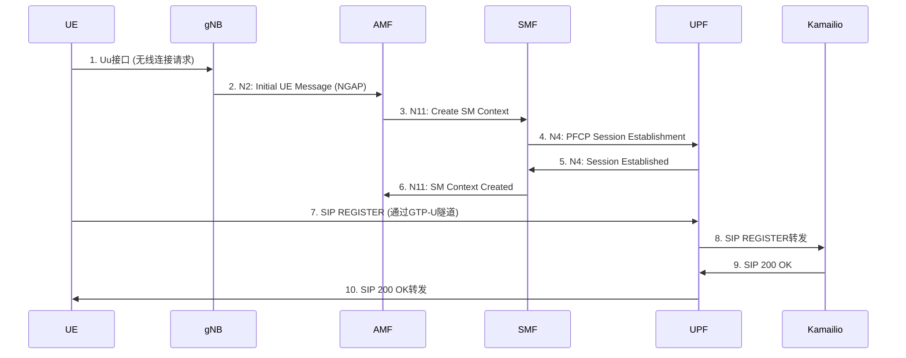
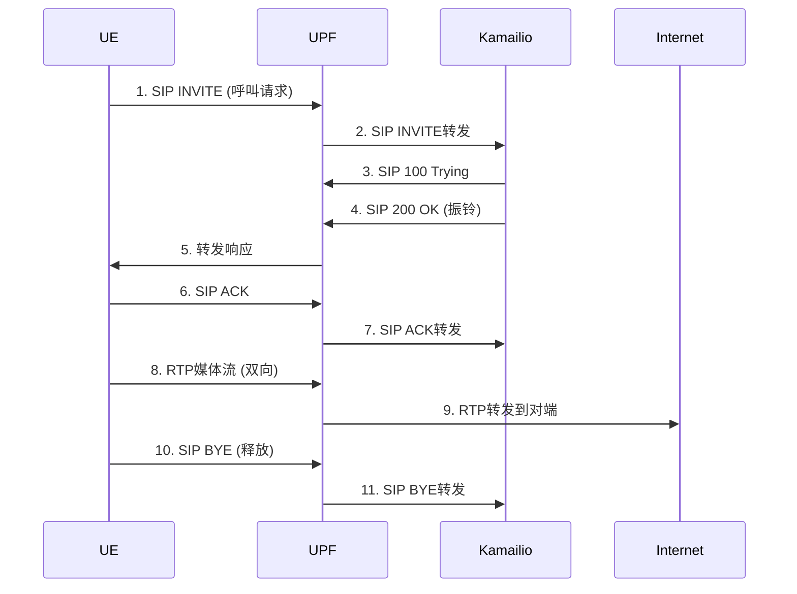

# 5GC 核心网网络通信架构

## 1. 整体架构

```
┌─────────────────────────────────────────────────────────────────┐
│                        Internet (DN)                             │
│                    172.23.150.46/20 (eth0)                       │
└─────────────────────────────────────────────────────────────────┘
                              ↑ NAT (N6)
                              │
┌─────────────────────────────────────────────────────────────────┐
│                         宿主机 (Host)                            │
│                                                                 │
│  ┌──────────────────────────────────────────────────────────┐ │
│  │          br-free5gc 网桥 (10.100.200.0/24)                │ │
│  │               网桥IP: 10.100.200.1                         │ │
│  │               IMS IP: 10.100.200.99                        │ │
│  │                                                          │ │
│  │  ┌────────┐ ┌──────┐ ┌──────┐ ┌──────┐ ┌──────┐         │ │
│  │  │ MongoDB│ │ NRF  │ │ AMF  │ │ SMF  │ │ UPF  │         │ │
│  │  │.2      │ │.4    │ │.11   │ │.8    │ │.3    │         │ │
│  │  └────────┘ └──────┘ └──────┘ └──────┘ └──────┘         │ │
│  │                                                          │ │
│  │  ┌──────┐ ┌──────┐ ┌──────┐ ┌──────┐ ┌──────┐ ┌──────┐ │ │
│  │  │ AUSF │ │ NEF  │ │ PCF  │ │ CHF  │ │ NSSF │ │ UDM  │ │ │
│  │  │.5    │ │.6    │ │.13   │ │.14   │ │.12   │ │.7    │ │ │
│  │  └──────┘ └──────┘ └──────┘ └──────┘ └──────┘ └──────┘ │ │
│  │                                                          │ │
│  │  ┌──────┐ ┌──────┐ ┌──────┐                             │ │
│  │  │ UDR  │ │ WebUI│ │Kamailio│                           │ │
│  │  │.9    │ │.10   │ │.99:5060│                           │ │
│  │  └──────┘ └──────┘ └──────┘                             │ │
│  └──────────────────────────────────────────────────────────┘ │
│                                                                 │
│  ┌──────────────────────────────────────────────────────────┐ │
│  │          eth1 (10.88.120.100/24) → gNB/RAN               │ │
│  │           N2 (SCTP) + N3 (GTP-U)                          │ │
│  └──────────────────────────────────────────────────────────┘ │
│                                                                 │
│  ┌──────────────────────────────────────────────────────────┐ │
│  │      路由: 10.60-65.0.0/16 → via UPF (10.100.200.3)      │ │
│  └──────────────────────────────────────────────────────────┘ │
└─────────────────────────────────────────────────────────────────┘
                              ↑ N2/N3
┌─────────────────────────────────────────────────────────────────┐
│                      gNB (RAN)                                  │
│                   IP: 10.88.120.212                             │
│              N2: SCTP (控制面) | N3: GTP-U (用户面)              │
└─────────────────────────────────────────────────────────────────┘
                              ↑ Uu (无线)
┌─────────────────────────────────────────────────────────────────┐
│                        UE (终端)                                │
│             UE IP: 10.60.0.x / 10.64.0.x                        │
│        IMS: Kamailio (10.100.200.99:5060)                       │
└─────────────────────────────────────────────────────────────────┘
```

## 2. 网络功能 (NF) 组件

| 组件 | IP地址 | 功能说明 |
|------|---------|----------|
| **MongoDB** | 10.100.200.2 | 数据库：存储订阅数据、策略数据 |
| **NRF** | 10.100.200.4 | 网络功能注册与发现 |
| **AMF** | 10.100.200.11 | 接入管理：注册、连接、可达性 |
| **SMF** | 10.100.200.8 | 会话管理：PDU会话建立、修改 |
| **UPF** | 10.100.200.3 | 用户面：数据转发、路由、NAT |
| **UDM** | 10.100.200.7 | 统一数据管理：用户数据 |
| **UDR** | 10.100.200.9 | 统一数据仓库：数据存储 |
| **AUSF** | 10.100.200.5 | 认证服务器功能 |
| **PCF** | 10.100.200.13 | 策略控制功能 |
| **NSSF** | 10.100.200.12 | 网络切片选择功能 |
| **NEF** | 10.100.200.6 | 网络开放功能 |
| **CHF** | 10.100.200.14 | 计费功能 |
| **WebUI** | 10.100.200.10 | Web管理界面 |
| **Kamailio** | 10.100.200.99 | IMS SIP服务器 (端口5060) |

## 3. 关键接口

### 控制面接口 (SBI + NGAP)

| 接口 | 端点 | 协议 | 功能 |
|------|------|------|------|
| **N1** | UE ↔ AMF | NAS | 注册、会话管理、IMS信令 |
| **N2** | gNB ↔ AMF | SCTP | NGAP信令（无线侧管理） |
| **N4** | SMF ↔ UPF | PFCP | 会话建立/修改/删除 |
| **N11** | AMF ↔ SMF | HTTP | 会话管理信令 |
| **N7** | SMF ↔ PCF | HTTP | 会话策略控制 |
| **N8** | AMF ↔ UDM | HTTP | 用户数据访问 |
| **N10** | SMF ↔ UDM | HTTP | 会话相关用户数据 |
| **N12** | AMF ↔ AUSF | HTTP | 认证服务 |
| **N13** | UDM ↔ AUSF | HTTP | 认证数据获取 |
| **N14** | AMF ↔ NRF | HTTP | NF发现 |
| **N15** | NRF ↔ 各NF | HTTP | NF注册与发现 |
| **N22** | AMF ↔ NSSF | HTTP | 切片选择 |
| **N5** | PCF ↔ AF | HTTP | 策略控制（IMS应用） |

### 用户面接口

| 接口 | 端点 | 协议 | 功能 |
|------|------|------|------|
| **N3** | gNB ↔ UPF | GTP-U | 用户数据隧道 |
| **N6** | UPF ↔ Internet | IP | 外部数据网络接入 |
| **N9** | UPF ↔ UPF | GTP-U | 数据转发（跨UPF） |

### IMS接口

| 接口 | 端点 | 协议 | 功能 |
|------|------|------|------|
| **SIP** | UE ↔ Kamailio | SIP/UDP | 注册、呼叫、消息 |
| **RTP** | UE ↔ UE | RTP | 媒体流（通过UPF） |

## 4. UPF内部架构

```
┌───────────────────────────────────────────────────────────┐
│                      UPF 容器                              │
│                                                           │
│  ┌─────────────────────────────────────────────────────┐ │
│  │           eth0 (10.100.200.3)                        │ │
│  │  • N4接口: PFCP信令 (与SMF通信)                       │ │
│  │  • NAT出口: → Internet                              │ │
│  │  • br-free5gc网桥连接                               │ │
│  └─────────────────────────────────────────────────────┘ │
│                          ↑                                │
│                          │                                │
│  ┌─────────────────────────────────────────────────────┐ │
│  │         upfusr0 (GTP-U隧道接口)                      │ │
│  │  • UE IP池: 10.60.0.0/16 ~ 10.65.0.0/16             │ │
│  │  • MTU: 1400                                         │ │
│  │  • Workers: 4                                        │ │
│  │  • Queue Size: 1024                                  │ │
│  │  • Userspace Forwarder                              │ │
│  └─────────────────────────────────────────────────────┘ │
│                          ↑                                │
│          GTP-U 解封装 (移除GTP头)                         │
│                          │                                │
│  ┌─────────────────────────────────────────────────────┐ │
│  │        N3 接口 (接收来自gNB的数据)                   │ │
│  │  • GTP-U隧道终点                                     │ │
│  │  • TEID映射到PDU会话                                 │ │
│  └─────────────────────────────────────────────────────┘ │
│                                                           │
│  路由表:                                                  │
│  • 10.60-65.0.0/16 → upfusr0 (UE流量)                   │
│  • default → eth0 (Internet)                            │
│  • NAT规则: MASQUERADE on eth0                          │
└───────────────────────────────────────────────────────────┘
```

## 5. 信令流程

### IMS注册流程



### IMS呼叫流程



### PDU会话建立流程

```
1. UE → AMF:   NAS: PDU Session Establishment Request
2. AMF → SMF:  N11: Create SM Context Request
3. SMF → UDM:  N10: Get SM Data
4. SMF → PCF:  N7: Create SM Policy
5. SMF → UPF:  N4: PFCP Session Establishment Request
6. UPF → SMF:  N4: PFCP Session Establishment Response
7. SMF → AMF:  N11: Create SM Context Response
8. AMF → gNB:  N2: PDU Session Resource Setup Request
9. gNB → UE:   RRC: DRB Setup
10. gNB → AMF: N2: PDU Session Resource Setup Response
11. AMF → SMF: N11: Update SM Context (AN Info)
12. SMF → UPF: N4: PFCP Session Modification Request
13. UE → AMF:  NAS: PDU Session Establishment Complete
```

## 6. 网络连接拓扑

```
                    Internet (DN)
                         │
                         │ N6 (NAT)
                         ↓
                    ┌────────┐
                    │   UPF  │ ←─────┐
                    │  .3    │       │ N4 (PFCP)
                    └────────┘       │
                         │ N3        │
                         │ (GTP-U)   │
                         ↓           │
                    ┌────────┐  ┌────────┐
                    │   gNB  │  │   SMF  │ ←────┐
                    │10.88.  │  │   .8   │      │ N11
                    │120.212 │  └────────┘      │
                    └────────┘       │          │
                         │ Uu        │ N2       │
                         │ (无线)    │ (SCTP)   │ N1 (NAS)
                         ↓           ↓          │
                    ┌────────┐  ┌────────┐ ┌────────┐
                    │   UE   │  │   AMF  │ │ Kamailio│
                    │10.60.  │  │   .11  │ │   .99   │
                    │  0.x   │  └────────┘ │ :5060  │
                    └────────┘       │     └────────┘
                                     │          ↑
                                     │ N14      │ SIP
                                     ↓          │
                                ┌────────┐     │
                                │   NRF  │     │
                                │   .4   │     │
                                └────────┘     │
                                     │         │
                                     │ N15     │
                                     ↓         │
                                ┌────────┐     │
                                │ MongoDB│ ←───┘
                                │   .2   │ (订阅数据)
                                └────────┘
```

## 7. DNN (Data Network Name) 配置

| DNN | CIDR | 用途 |
|-----|------|------|
| **internet** | 10.60.0.0/16 | 默认数据网络 |
| **internet** | 10.61.0.0/16 | 备用数据网络 |
| **IMS** | 10.62.0.0/16 | IMS数据网络 |
| **IMS** | 10.63.0.0/16 | IMS备用 |
| **ims** | 10.64.0.0/16 | IMS小写配置 |
| **ims** | 10.65.0.0/16 | IMS小写备用 |

## 8. 关键配置检查清单

### IMS配置

- ✅ Kamailio监听: `10.100.200.99:5060` (UDP/TCP)
- ✅ IMS IP添加到 `br-free5gc`
- ✅ UPF路由: UE IP池可达Kamailio
- ✅ NAT: UPF `eth0` → Internet

### 网络优化

- ✅ 禁用checksum offload (`free5gc-disable-offload.service`)
- ✅ UE路由配置 (`free5gc-ue-routes.service`)

### 抓包诊断位置

| 位置 | 接口 | 抓包内容 |
|------|------|----------|
| **宿主机** | `br-free5gc` | SBI接口、SIP信令 |
| **宿主机** | `eth1` | N2 (NGAP/SCTP)、N3 (GTP-U) |
| **UPF容器** | `upfusr0` | UE数据包、IMS信令 |
| **UPF容器** | `eth0` | PFCP、Internet流量 |

## 9. 常见故障诊断

### IMS注册失败

**症状**: UE无法注册IMS，SIP消息无响应

**检查步骤**:
1. Kamailio是否监听 `10.100.200.99:5060`
2. UPF能否ARP到Kamailio IP
3. UE PDU会话是否建立（SMF日志）
4. 抓包: `tcpdump -i br-free5gc -n port 5060`

**常见原因**:
- ❌ Kamailio IP未配置 → `ip addr add 10.100.200.99/24 dev br-free5gc`
- ❌ UPF未建立PDU会话 → 检查SMF/UPF PFCP日志
- ❌ 无线连接中断 → RadioNetwork Cause[24]

### PDU会话释放

**症状**: IMS会话突然释放

**检查步骤**:
1. AMF日志: `RadioNetwork Cause[24]` → UE与gNB断开
2. SMF日志: `Unexpected state` → 状态不一致
3. AMF Paging: UE进入CM-IDLE状态
4. gNB状态: 无线链路质量

**常见原因**:
- 无线信号弱 → 检查UE位置和信号强度
- gNB配置问题 → 检查RAN配置
- UE异常断开 → 检查UE日志

### 数据包丢失

**症状**: IMS媒体流断断续续

**检查步骤**:
1. UPF接口统计: `docker exec upf cat /proc/net/dev`
2. 抓包: `tcpdump -i eth1 -n 'portrange 10000-65535'`
3. QoS配置: 检查PCF策略
4. MTU设置: UPF `upfusr0` MTU=1400

---

**生成时间**: 2026-05-28  
**核心网版本**: free5GC v4.2.1  
**IMS服务器**: Kamailio
